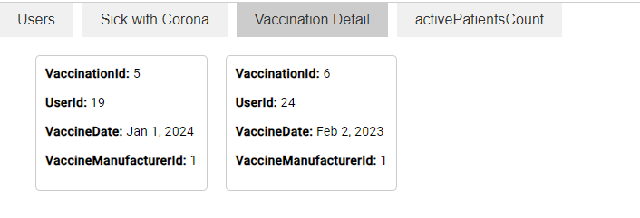

# HadassimTaskRepo
server-
ASP.NET Core Web Application This is a C# project developed in ASP.NET Core Web Application using the 4-layer Entity Framework method and Swagger
client-
Developed in Angular language

The project simulates a system for managing a corona patient in a health fund with 4 tables: user, patient, vaccine, vaccine manufacturer
For API documentation.
For each user, the system records when he was sick and when he received vaccinations, and for each vaccine, the manufacturer of that vaccine is saved

Prerequisites:
Visual Studio 2022
.NET Core
SQL Server
Visual Studio Code

Getting Started with the Project:
-Please download the project to your local machine.
-Open the server folder
-Open the project in Visual Studio.
-Open your Sql Server and when you connect to sql you "conntion string" , copy the connection strint
paste the "conntion string" in : layer Entity-> file database -> you should see my "conntion string" so replace and paste there
-Open the Package Manager Console and run the following command to create the database:     add-migrtion , After it has finished running run the command initConnect 
And after that Update-Database 
-Build and run the project.
-Now the swagger will open for you in routing https://localhost:7076/swagger/index.html
-Open the client folder
-Open the project in Visual Studio code.
-Open the Terminal and run the npm start command
-Now open the project in http://localhost:4200

Show all users-
Each of the users can be edited and deleted to see when he was sick and when he received a vaccine:

Add user:

Get user by Id:

You can see all the vaccinated:

All corona patients can be seen:

 Hope you enjoy!
